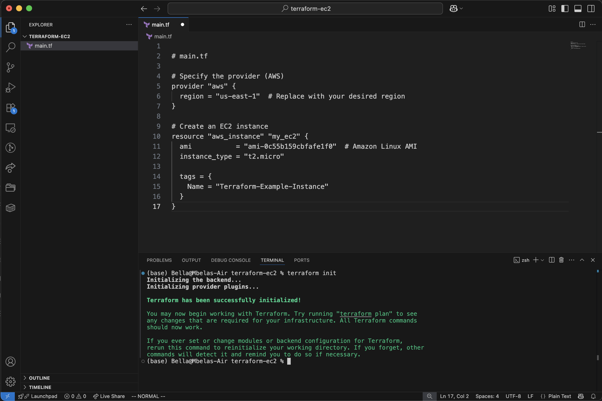
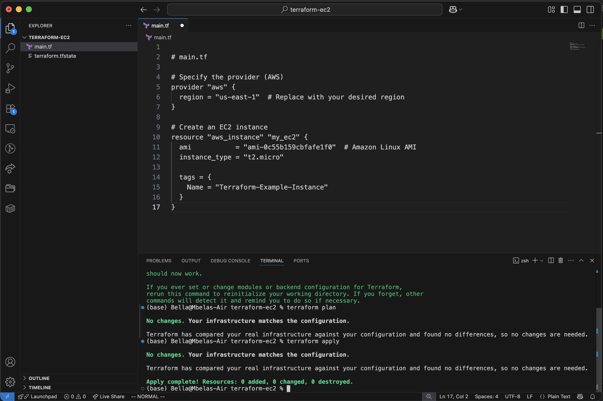
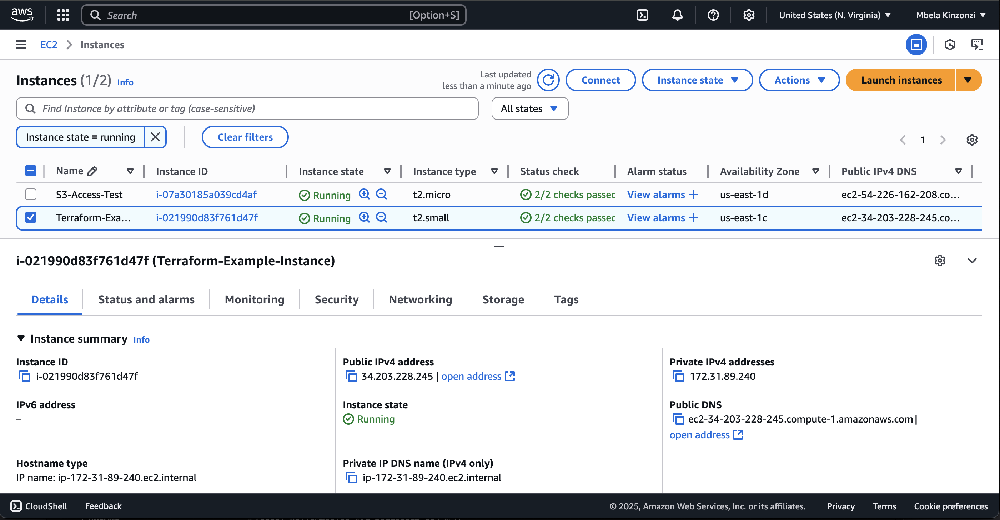
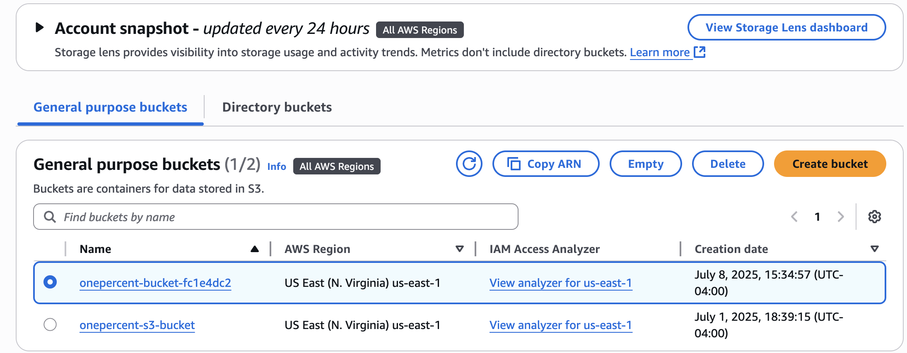
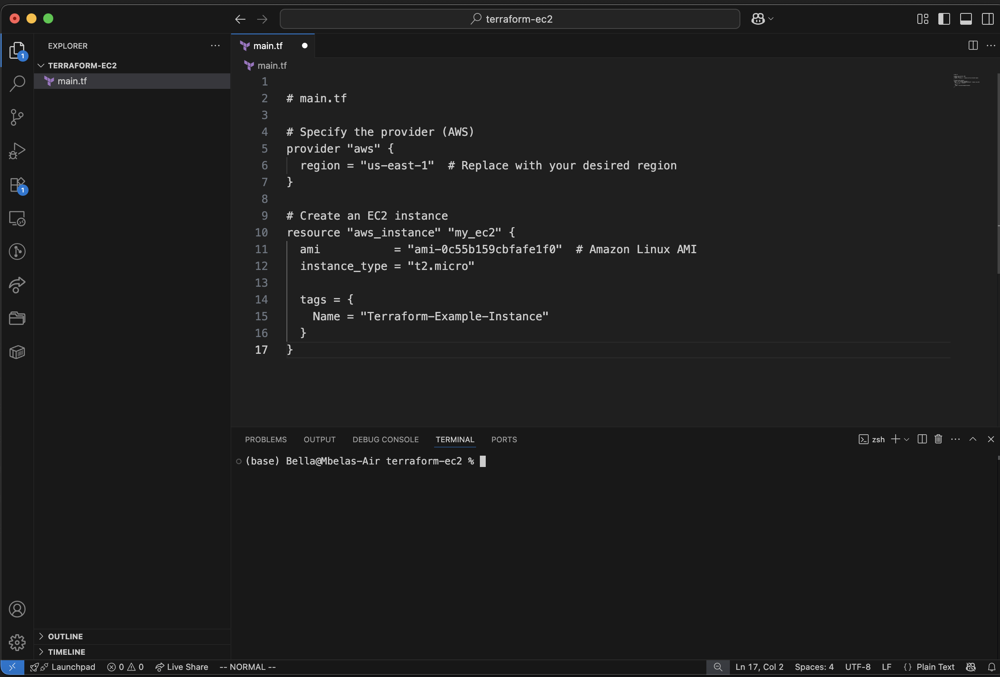
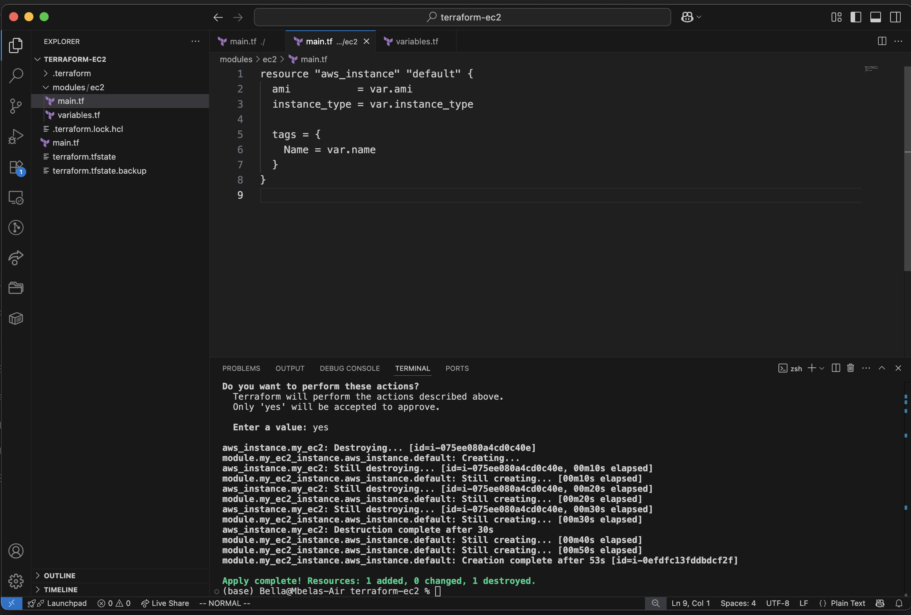
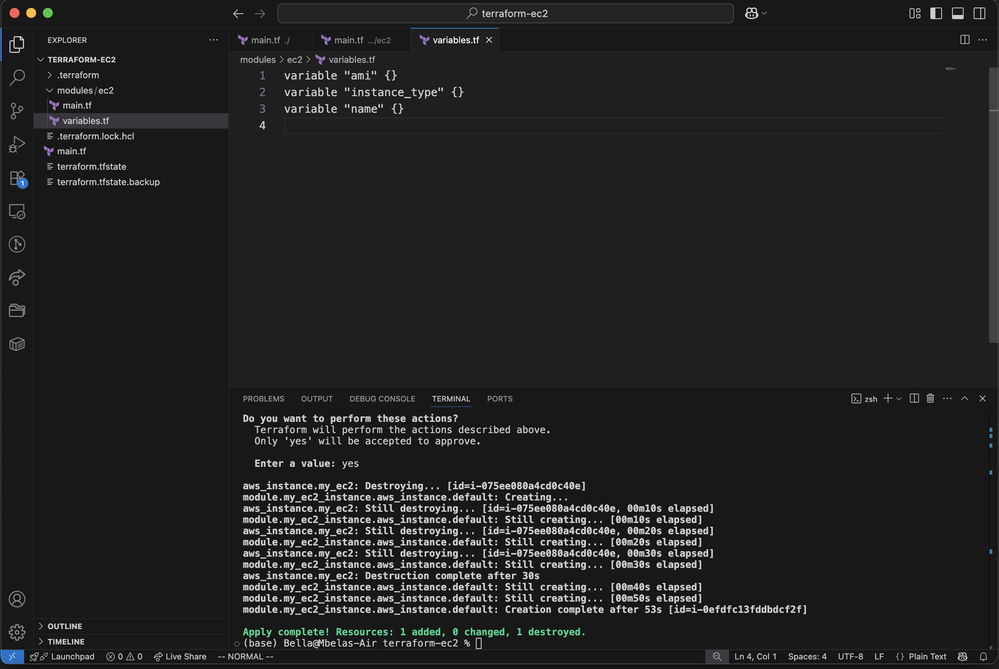

---

## 📸 Screenshots

### Terraform EC2 + S3

| Step | Description                         | Screenshot                                  |
|------|-------------------------------------|---------------------------------------------|
| 1    | Terraform Initialized               |  |
| 2    | EC2 Instance Applied                |  |
| 3    | EC2 Visible in AWS Console          |  |
| 4    | S3 Bucket Visible in AWS Console    |  |
| 5    | Module Block in main.tf             |  |
| 6    | ec2/main.tf in Module Folder        |  |
| 7    | ec2/variables.tf in Module Folder   |  |

---

## 🔗 GitHub Repository

👉 [github.com/mkinz830/terraform-aws-project](https://github.com/mkinz830/terraform-aws-project)
